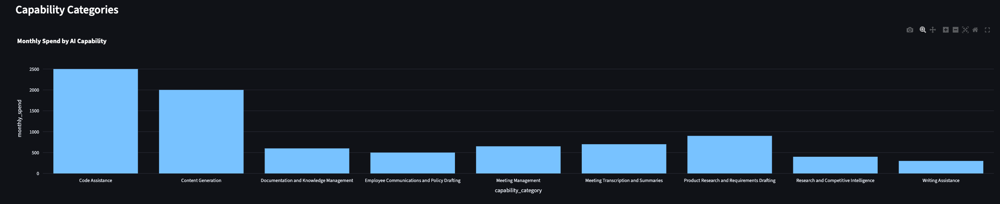
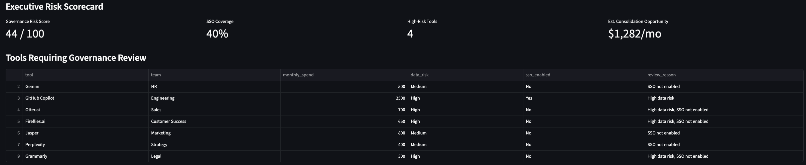
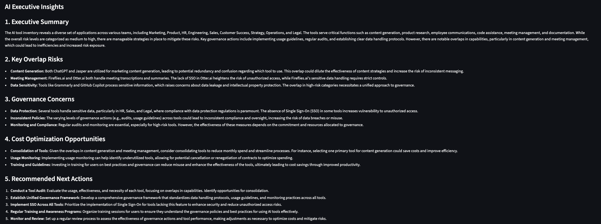

# AI Sprawl Analyzer

AI governance and enterprise tool sprawl analyzer for identifying overlapping AI capabilities, governance risks, and optimization opportunities.

## Overview

AI adoption across enterprises is accelerating rapidly, often resulting in:
- duplicate AI capabilities
- unmanaged AI spend
- inconsistent governance controls
- shadow AI usage
- fragmented vendor ecosystems
- data security and compliance risks

AI Sprawl Analyzer provides:
- AI-powered capability classification
- governance risk scoring
- overlap detection
- executive reporting
- spend visibility
- AI portfolio optimization insights

---

## Features

### AI-Powered Tool Classification
Uses OpenAI to classify AI tools by:
- capability category
- governance risk
- overlap potential
- recommended governance actions

### Executive Risk Scorecard
Generates:
- governance risk score
- SSO coverage metrics
- high-risk tool counts
- consolidation opportunity estimates

### Governance Intelligence
Automatically identifies:
- overlapping AI tools
- non-SSO-enabled applications
- high-risk data exposure
- governance gaps
- cost optimization opportunities

### Executive Insights
Generates AI-powered:
- executive summaries
- governance recommendations
- overlap analysis
- optimization strategies

---

## Architecture

```text
CSV Inventory
↓
Pandas Processing Layer
↓
OpenAI Classification Layer
↓
Governance Scoring Engine
↓
Executive Insights Generation
↓
Streamlit Dashboard
```

---

## Screenshots

### Executive Dashboard



### AI Executive Insights



### Governance Risk Review



---

## Tech Stack

- Python 3.12
- Streamlit
- OpenAI API
- Pandas
- Plotly
- dotenv

---

## Project Structure

```text
ai-sprawl-analyzer/
├── app.py
├── requirements.txt
├── src/
│   ├── ai_classifier.py
│   ├── insights_generator.py
│   └── risk_scoring.py
├── data/
└── README.md
```

---

## Setup

### Create Virtual Environment

```bash
uv venv --python 3.12
source .venv/bin/activate
```

### Install Dependencies

```bash
uv pip install -r requirements.txt
```

### Configure Environment Variables

Create `.env`

```env
OPENAI_API_KEY=your_api_key
```

---

## Run Application

```bash
streamlit run app.py
```

---

## Example Governance Insights

- Detect overlapping AI writing assistants
- Identify non-SSO-enabled applications
- Surface high-risk AI tools
- Recommend governance controls
- Estimate consolidation opportunities

---

## Future Enhancements

- Semantic capability clustering
- Vector-based overlap detection
- AI capability taxonomy graphs
- Vendor consolidation analytics
- PDF executive report export
- Enterprise connector integrations
- Real-time SaaS telemetry ingestion

---

## Strategic Focus

This project explores the intersection of:
- enterprise architecture
- AI governance
- operational intelligence
- SaaS portfolio optimization
- AI-native operating models
- enterprise AI transformation
